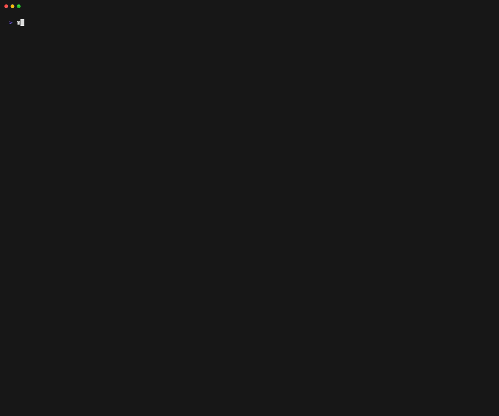

<h1 align="center">mqv</h1>

[](https://github.com/harehare/mx/actions/workflows/ci.yml)

A library and CLI tool for rendering Markdown documents with syntax highlighting and rich text formatting.
Built with [mq](https://github.com/harehare/mq) - jq-like command-line tool for markdown processing.



## Features

- 🎨 **Syntax Highlighting**: Tree-sitter powered syntax highlighting for 13+ programming languages
- 📝 **Rich Markdown Rendering**: Support for headers, lists, code blocks, links, images, and more
- 🔔 **GitHub-style Callouts**: NOTE, TIP, IMPORTANT, WARNING, CAUTION
- 🔗 **Clickable Links**: Terminal hyperlinks using OSC 8
- 📦 **Library and CLI**: Use as a library or standalone CLI tool

## Installation

### Cargo

```sh
$ cargo install --git https://github.com/harehare/mqv.git
```

## Supported Languages

- Rust, JavaScript, TypeScript (+ TSX)
- Python, Go, Java
- C, C++
- HTML, CSS, JSON
- Bash/Shell

## Usage

### As a CLI Tool

View a markdown file:
```bash
mqv README.md
```

Pipe markdown content:
```bash
echo "# Hello\n\n\`\`\`rust\nfn main() {}\n\`\`\`" | mqv
```

### As a Library

Add to your `Cargo.toml`:
```toml
[dependencies]
mqv = {git = "https://github.com/harehare/mqv.git"}
```

Use in your code:
```rust
use mqv::{render_markdown, render_markdown_to_string};
use mq_markdown::Markdown;

fn main() -> Result<(), Box<dyn std::error::Error>> {
    let markdown: Markdown = "# Hello\n\nWorld".parse()?;

    // Render to a writer
    let mut output = Vec::new();
    render_markdown(&markdown, &mut output)?;

    // Or render to a string
    let rendered = render_markdown_to_string(&markdown)?;
    println!("{}", rendered);

    Ok(())
}
```

## API Documentation

### `render_markdown`

Render a Markdown document to any writer that implements `Write`:

```rust
pub fn render_markdown<W: Write>(markdown: &Markdown, writer: &mut W) -> io::Result<()>
```

### `render_markdown_to_string`

Render a Markdown document to a `String`:

```rust
pub fn render_markdown_to_string(markdown: &Markdown) -> io::Result<String>
```

### `SyntaxHighlighter`

Create and use a syntax highlighter independently:

```rust
use mqv::SyntaxHighlighter;

let mut highlighter = SyntaxHighlighter::new();
let code = "fn main() { println!(\"Hello\"); }";
let highlighted = highlighter.highlight(code, Some("rust"));
println!("{}", highlighted);
```

## Examples

See the [examples](examples/) directory for more usage examples.

Run an example:
```bash
cargo run --example basic_usage
```

## License

MIT
